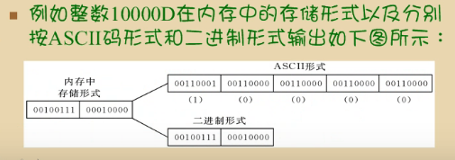
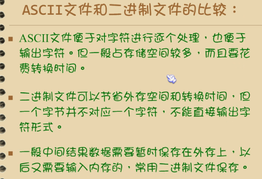
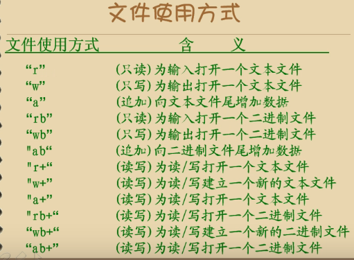
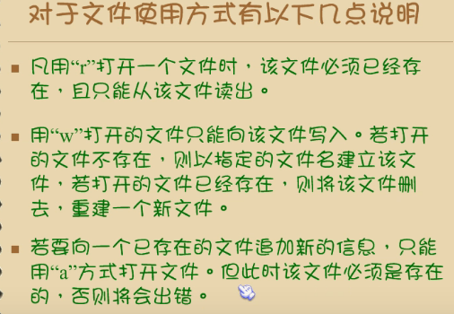
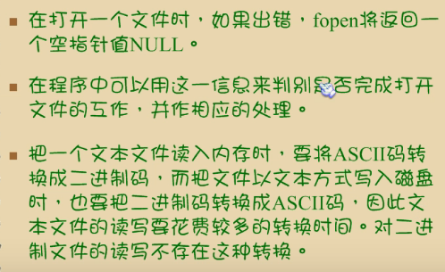
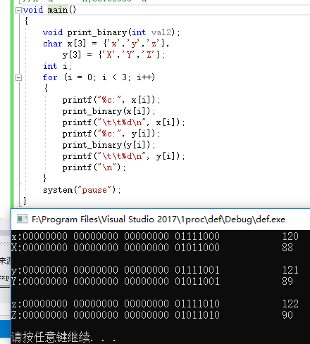
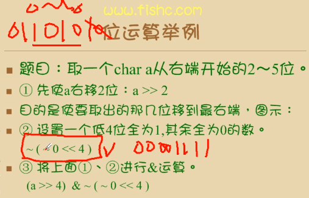
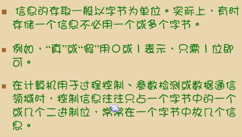
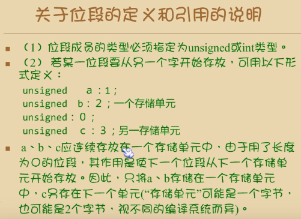
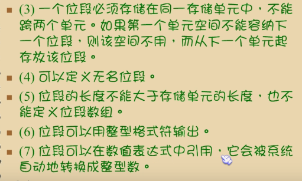

# 文件操作
## c文件概述

文件名={源程序文件.c，目标文件.obj，可执行文件，库文件.h}

操作系统是以文件为单位对数据进行管理的


*D表示十进制，H表示十六进制*



## 文件的打开与关闭
### 文件类型指针
```
FILE *fp;
//fp是个指向FILE类型结构体的指针变量，在<stdio.h>里
```
使fp指向某一个文件的结构体变量，从而通过该结构体变量中的文件信息访问该文件。

### FILE类型的数组
FILE f[5];定义了一个结构体数组f，它有5个元素，可以用来存放5个文件的信息。

### 文件的打开（fopen函数）
```
FILE *fp;
fp=fopen(文件名,使用文件方式);
//打开成功返回1，否则返回0
```


- 文件名：准备访问的文件的名字
- 方式：是读还是写
- 用哪一个指针变量指向被打开的文件

**文件的使用方式**


Remark：


```
#include <stdio.h>
#include <stdlib.h>	//system()

void main()
{
	FILE *fp;
	if (!(fp = fopen("F:\\Program Files\\Visual Studio 2017\\1proc\\def\\test.txt", "w")))	
	//注意要双斜杠，rb表示二进制只读
	//路径里的斜杠写双反斜杠\\，或者单斜杠/，可交替使用。但最好用c语言的标准方式双反斜杠\\
	{
		printf("can not open.\n");
		system("pause");
	}
	else printf("open success!\n");
}
```
### 文件的关闭
fclose(文件指针);

使文件指针变量不指向该文件，关闭成功返回值为0；否则返回EOF（-1）
## 文件的读写
头文件：#include <stdio.h>
- 字符读写函数：fgetc	和	fputc
- 字符串读写函数：fgets	和	fputs
- 数据块读写函数：fread	和	fwrite
- 格式化读写：fscanf	和	fprinf

### 字符读写函数

- fputc(ch,fp);
//将字符（ch的值'a'）输出到fp所指向的文件中去

Remark：fputc函数
- 使用写或读写打开一个文件会清除原文件内容，要保留原内容需要用追加方式打开文件。
- 每写入一个字符，文件内部位置指针向后移动一字节。
- fputc返回值：写入成功返回写入的字符，否则返回EOF（-1）

- 例子
```
#include <stdio.h>
void main()
{
	FILE *fp;
	char ch, filename[20];
	printf("please input the filename you want to write:");
	scanf("%s", filename);

	if (!(fp = fopen(filename, "wt+")))	//wt+打开一个文本文件，允许读和写
	{
		printf("cannot open the file!\n");
		exit(0);	//终止程序
	}

	printf("please input the sentences you want to write:");
	ch = getchar();	
	ch = getchar();
	//充分接受前面缓冲区的多余字符，少一行getchar（）会使txt前面多一行空行。
	while (ch != EOF)	//回车ctrl+Z再回车，就能退出。
	{
		fputc(ch, fp);
		ch = getchar();	//写入文件
	}

	fclose(fp); 
}
```
- fgetc()字符读取
ch=fgetc(fp);
//从打开的文件fp中读取一个字符并送入ch中

Remark:
- 读取文件必须以读或读写方式打开
- 刚打开文件时指针会指向文件第一个字符。文件内部包含一个指针，多次fgetc读取同一个文件会使指针自动后移，连续读取
```
void main()
{
	FILE *fp;
	char ch, filename[20];
	printf("please input the filename you want to write:");
	scanf("%s", filename);

	if (!(fp = fopen(filename, "r")))	
	{
		printf("cannot open the file!\n");
		exit(0);	//终止程序
	}
	ch = fgetc(fp);
	while (ch != EOF)	//回车ctrl+Z再回车，就能退出。
	{	
		putchar(ch);
		ch=fgetc(fp);
	}

	fclose(fp); 
	system("pause");
}
```
从二进制文件顺序读入字符无法用-1EOF【end of file】判定，用feof函数判定。读到文件末尾时会返回1.
```
while(!feof(fp))
{
	ch=fgetc(fp);
}
```
- 作业：图片文件合成器！
cmd:

```
F:\
copy /?	//进入help

F:\>copy /b 1.jpg+2.rar 3.jpg	// /b表示一个二进制文件，将rar文件的二进制码直接copy到1.jpg后面，合成一个新文件3，并以jpg形式储存。由于jpg只认识jpg的开头结尾，所以3.jpg会显示1.jpg图片。
```

**源代码：[图种合成大法好.c](code/图种合成大法好.c)***

## 文件的定位
## 出错的检测
## 文件输入输出小结


# 位运算

因为系统中，常要处理二进制位的问题。比如将一个存储单元中的各二进制位左移或右移以为，两个数按位相加等。
更深入底层，效率更高，出错的可能性更高。

## 位运算符和位运算
运算符	|含义	|运算符	|含义
---	|---	 |---	|---
&	|按位与	 |~		|取反
\|\	|按位或	 |<<	|左移
^	|按位异或|>>	|右移

Remark:
- 除取反~外，都是二元运算符
- 运算量只能是int或char型数据，不能为实型数据f。

### 按位与&
参加运算的两个数据，按二进制位进行与运算
- 如果两个相应的二进制位都为1，则该位的结果值为1；否则为0
100&101=100
110&101=100
3D&5D=
00000011&
00000101=
00000001
==1
- 如果参加&运算的是负数（-3&-5），则要以补码形式表示为二进制数，然后再按位进行与运算

按位与运算&的用途：
- 清零：可以使二进制数的某一位清零。【二进制从右往左第一个数是第0位】
11100101&
11111011=
11100001
- 取一个数中某些指定位
例如：我们需要对一个字型数据（word，一个字16位）取出其低8位的值时，可以将高8位与0000 0000进行&运算，低8位与1111 1111进行&运算。

### 按位或运算|
两个相应的二进制位中只要有一个为1，该位的结果值为1

### 作业：将输入的大写字母转换为小写，输入的小写字母转换为大写
要求：用位操作完成。
前置工作：void print_binary(int val2);寻找对应二进制数的规律。

```
//a~z==97--122	a+32	a & 95
//A~Z==65--90	A-32	A | 32
//a-->A		a&11011111==A
//A--a		A|00100000==a
void main()
{
	void print_binary(int val2);
	char x[3] = {'x','y','z'},
		y[3] = {'X','Y','Z'};
	int i;
	for (i = 0; i < 3; i++)
	{	
		printf("%c:", x[i]);
		print_binary(x[i]);
		printf("\t\t%d\n", x[i]);
		printf("%c:", y[i]);
		print_binary(y[i]);
		printf("\t\t%d\n", y[i]);
		printf("\n");
	}
	system("pause");
}

void print_binary(int val2)	//将整数以二进制打印出来
{
	unsigned char *p = (unsigned char*)&val2 + 3; //从低位到高位,低端字节计算机
	for (int k = 0; k <= 3; k++)
	{
		int val2 = *(p - k);
		for (int i = 7; i >= 0; i--)
		{
			if (val2 & (1 << i))
				printf("1");
			else
				printf("0");
		}
		printf(" ");
	}

}

//二进制数转换为十进制，或者利用windows+r打开calc.进入程序员模式
void main()
{
	char a[17];
	printf("输入一个二进制数：");
	gets(a);
	int len, i, sum = 0, m, j;
	len = strlen(a);
	if (len <= 16)
	{
		for (i = 0; i < len; i++)
		{
			m = 1;
			if (a[i] == '1')
			{
				for (j = 1; j <= len - i - 1; j++)
					m *= 2;
				sum += m;
			}
		}
		printf("%d", sum);
	}

	system("pause");
}
```
进行大小写判断并转换：
```
//a~z==97--122		a+32	a & 95
//A~Z==65--90		A-32	A | 32
char bigsmall(char x);
void main()
{
	char y,x;
	do
	{
		do
		{
			printf("\nplease input a character:");
			scanf("%c", &x);	
			getchar();
			y = bigsmall(x);
		} while (y == 0);
		printf("\nthe result is:%c\n", y);
		printf("\n\t\tPress any key to continue. Press ESC to exit...");
	} while (getch() != 27);

	system("pause");
}

char bigsmall(char x)
{
	//判断大小写
	if (x >= 'a' && x <= 'z')
	{
		return x & 95;	//x是十进制，因此右值也要以十进制表示，但计算时转换为二进制进行按位与运算
	}
	else if (x >= 'A' && x <= 'Z')
	{
		return x | 32;
	}
	else 
	{ 
		printf("\t\tError,please input again.\n");
		return  0;	//ASCII码里0是空格
	}
}
```

## 清除缓冲区
```
//在我们输入第一个字符后敲击‘\n’之后,程序就结束了，这是因为我们没有清空缓存区，getchar（）函数接收的是‘\n’,最后造成了程序的停止。
//使用fflush（）函数刷新标准输入缓冲区
#include<stdio.h>
#include<stdlib.h>
int main()
{
    int num;
    char a;
    scanf("%d", &num);

    fflush(stdin);

    a = getchar();
    printf("num=%d,a=%c\n", num, a);
    system("pause");
    return 0;
}

```
### “异或”运算符^
也称XOR运算符（判断是不是异号）
- 若参加运算的两个二进制位同号则结果为0，异号则结果为1.
0^1	=	1^0	=	1;
0^0	=	0;
1^1	=	0

性质：
1. 任意一个变量X与其自身进行异或运算，结果为0，即X^X=0
2. 任意一个变量X与0进行异或运算，结果不变，即X^0=X
3. 异或运算具有可结合性，即a^b^c=（a^b）^c=a^（b^c）
4. 异或运算具有可交换性，即a^b=b^a

功能：
- 使特定位翻转：
设有0111 1010，想使其低4位翻转，可以将它与0000 1111进行^运算
0111 1010^
0000 1111=
0111 0101
- 与0相^，保留原值
0000 1010^
0000 0000=
0000 1010
- 交换两个值，不用临时变量
例如交换a=3,b=4的值，只需：
a=a^b;
b=b^a;
a=a^b;
- a^b=b^a
- 异或是可以逆运算的，即
若a^b=c,则a=b^c

### 取反~
对一个二进制数按位取反，将0变1，将1变0
例如：~025【0开头的是八进制数】是对八进制数025按位求反
25		=	00010101
~025	=	11101010

### 按位左移<<
将一个数的各二进制位全部左移若干位

例如：a=<<2是将a的二进制数左移2位，右边补0.
若a=15，即0000 1111，则a<<2==0011 1100==60D.

- 可以看出60D==a*2*2，在无溢出的前提下，每左移一位就乘一个2.
- 若高位左移溢出，则自动舍弃。所以60D<<3==1100 0000【一个字节是8位】

### 按位右移>>
右端低位自动舍弃，对于无符号数，高位补零。
例如：unsigned int a=017时，a=0000 1111，a>>2==0000 0011
- 右移一位相当于除以2
- 右移时，需要注意符号问题：
无符号数，右移时左边高位补0.
对于有符号值，如果原来的符号位为0【该数为正】，则左边移入0；
如果符号位为1，则左边移入1，但要取决于所用的计算机系统。

例如：a=-2D
a		==	1111 1110
无符号数：a>>1	==	0111 1111(逻辑右移)==
有符号数：a>>1	==	1111 1111(算术右移)==-1

- 例子：
```
void main()
{
	
	unsigned char a = -2;	//1111 1110
	signed char b = -2;
	a=a >> 1;	//逻辑移位：移入了0
	b = b >> 1;	//算术移位：移入了1
	printf("%d\n\n", a);	//127	==0111 1111
	printf("%d\n\n", b);	//-1	==1111 1111
	getch();
}
```
### 位运算与赋值运算符进行复合
例如：
&=,	|=,	>>=,	<<=,	^=

## 位运算举例
- 题目1

```
void print_binary(int val2);
void main()
{
	char a,b,c,d;
	a = 23;
	print_binary(a);
	printf("\n");

	b = a >> 2;
	c=~(~0 << 4);
	d = b & c;

	print_binary(d);
	getch();
}
```
- 要求将a进行右循环移位，一个一个移，从第一个不为0的数开始，将低位溢出的值补回高位
```
#include <stdio.h>
#include <stdlib.h>	//system()
#include <math.h>

#define n 3	//n为右循环次数
#define VAL 32	//val给a赋的值
void print_binary(int val2);

void main()
{
	char a,b,x,y;
	a =VAL;
	b = a;
	int i,k;	//k是二进制a的位数
	print_binary(a);

	for (k = 1; (b=b>>1)!=0; k++)
	{
		;
	}
	printf("\na的二进制数一共有%d位\n\n",k);
	
	printf("开始右循环移位:\n\n");
	for (i = 0; i < n; i++)
	{
		x = a & (~(~0 << 1));
		printf("第%d轮得到的最低位为\t",i+1);
		printf("%d\t\t",x);
		a = (a >> 1) + pow(x*2, k-1);
		printf("a=\t");
		print_binary(a);	
		printf("\n");
	}
	printf("\n最后的结果是：\n");
	print_binary(a);	

	getch();
}

```

- 右循环移位，一次性右移n位并补回高位。
```
#include <stdio.h>
#include <stdlib.h>	//system()
#include <math.h>

#define n 3	//n为右循环次数
#define VAL 23	//val给a赋的值
void print_binary(int val2);

void main()
{
	char a,b,c;
	a =VAL;
	printf("a=\n");
	print_binary(a);

	b = a << (sizeof(char) * 8 - n);
	c = a >> n;
	c = c | b;

	printf("\n最后的结果是：\n");
	print_binary(c);	

	getch();
}
```

## 位段 bit field


定义：
```
struct packed-data
{
	unsigned a:2;	//2byte
	unsigned b:6;
	unsigned c:4;
	unsigned d:4;
	int i;	//4字节*8=32byte
}data;
```
Remark：




