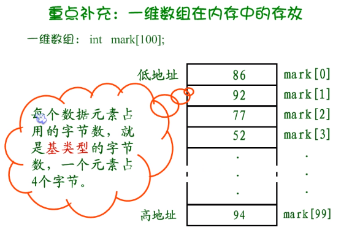
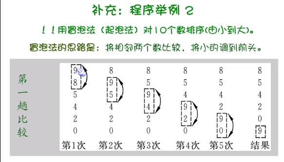
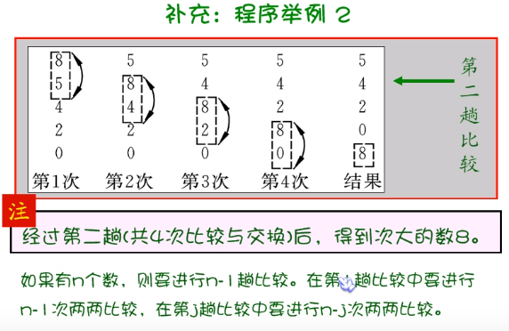

# 数组概念

- 数组一组同类数据，是有序集合A = { a1,a2,a3 }

a_i = 数组元素_下标变量

int a [10];	//定义一个整型数组，数组名a，此数组有十个整型元素，下标从a[0]开始到a[10]。

int k, a[k];	//不能用变量说明数组大小

# 一位数组在内存中的存放



一个a[0]4字节，数组a一共400字节。

- 下标可以使表达式
```
a[i + j]
a[2 * 3]
a[i++]
```

- 数组的输出只能用循环语句一个一个输出，而不能$printf("\%d", a); $【这样是打印数组的地址】一次性输出所有数
```
for (i = 0; i < 10; i++)
{
	printf("%d", a[i]);
}
```

# 数组的引用

```
int a[10];	//定义数组
t = a[6];	//引用；此时6不代表数组长度
```

- 一维数组的引用
初始化赋值
```
#include <stdio.h>
#include <stdlib.h> //pause

void main()
{
	int i, a[10];
	for (i = 0; i < 10; i++)
	{
		a[i] = i;
	}
	for (i = 9; i > -1; i--)
	{
		printf("%d ", a[i]);
	}
	system("pause");
}
```

OR
```
int i, a[10] = { 0,1,2,3,4,5,6,7,8,9 };
```
int a[10]={1} 会使a[0]为1，a2-a9缺省都为0.

int  a[] = { 0,1,2,3,4,5,6,7,8,9 };	//可以省略长度10


动态赋值：用户自己输入数字

```
//输出一组数中的最大值。
void main()
{
	int i, max, a[10];
	printf("input 10 numbers:\n");
	for (i = 0; i < 10; i++)
	{
		scanf("%d", &a[i]);
		getchar();
	}
	max = a[0];
	for (i = 1; i < 10; i++)
	{
		if (a[i] > max) max = a[i];
	}
	printf("maximum=%d\n", max);
	system("pause");
}
```
- 求Fibonacci数列第n个数
```
void main() {

	for (;;)
	{
		int n;
		printf("\n input a integer(<10000) n=");
		scanf("%d", &n);
		getchar();
		long int x[10000] = { 1,1 }, i, a, b;
		x[0] = 1, x[1] = 1;
		a = 1, b = 1;
		for (i = 2; i < n; i++)
		{
			x[i] = x[i - 1] + x[i - 2];
		}
		printf("\t F[%d]=%ld\n", n, x[n - 1]);
		printf("\t press enter to continue or press ESC to exit:");
		if (getch() == 27) break;
	}
	system("pause");
}
```

- 冒泡法
两两比较，小的数往上调换





- 输入一列数，用冒泡法排列并从小到大输出
```
void main()
{
	int i, temp;
	int a[10];
	printf("input 10 numbers and sort\n");
	for (i = 1; i <= 10; i++)
	{
		printf("input a[%d]:", i);
		scanf("%d", &a[i - 1]);
	}
	int j, k;
	for (j = 1; j <10; j++)
	{
		for (k = 0; k < 10 - j; k++)
		{
			if (a[k] > a[k + 1])
			{
				temp = a[k];
				a[k] = a[k + 1];
				a[k + 1] = temp;
			}
		}
	}
	printf("\na[i]从小到大排列为：");
	for (i = 0; i <= 9; i++)
	{
		printf("%d,", a[i]);
	}
	system("pause");
	return 0;
}

```

## 二维数组的定义与引用

```
float a[3][4] //定义一个3行4列的矩阵

//内存中是这样表示的
a[0][0], a[0][1], a[0][2], a[0][3]
a[1][0], ..., a[1][3]
a[2][0], ..., a[2][3]
//按行排列，一行排完了，下一个地址排下一行第一个元素。

//三维数组a[x][y][z]先排x再排y再排z。z排满了就把y=y+1，z从0再开始。
```

- 二维数组赋值
```
int a[3][4] = { {1,2,3,4},{5,6,7,8},{9,10,11,12} };

//可以将所有数据写在一个花括号内，按数组排列的顺序对各元素赋初始值。
int a[3][4] = { 1,2,3,4,5,6,7,8,9,10,11,12 };

//可以对部分元素赋初值.其他数则缺省自动为0
int a[3][4] = { {1},{5},{9} };


//如果对全部元素赋初值，则定义数组时对第一维的长度可以不指定。
int a[][4] = { 1,2,3,4,5,6,7,8,9,10,11,12 };
int a[][4] = { {0,0,3},{},{0,10} };
```

- 计算全班（5个人）3科成绩平均值，以及总平均值

```
void main()
{
	int i, j;
	float v[3], average, sum = 0;
	int a[5][3] = { {80,75,92},{61,65,71},{59,63,70},{85,87,90},{76,77,85} };
	for (i = 0; i < 3; i++)
	{
		for (j = 0; j < 5; j++) sum = sum + a[j][i];
		v[i] = sum / 5;
		sum = 0;
	}
	average = (v[0] + v[1] + v[2]) / 3;
	printf("ave_math:%f\nave_language:%f\nave_C++:%f\n", v[0], v[1], v[2]);
	printf("total average:%f\n", average);
	system("pause");
	return 0;
}
```
- 转置：将一个数组行列互换，存到另一个数组中。

$$
a=\bigl[
	\begin{smallmatrix}
	1&2&3\\
	4&5&6
	\end{smallmatrix}
\bigr]\tag{1}
$$

$$
b=\bigl[
	\begin{smallmatrix}
	1 & 4\\
	2 & 5 \\
	3&6
	\end{smallmatrix}
	\bigr]\tag{2}
$$

```
void main()
{
	int i, j;
	int a[2][3] = { {1,2,3},{4,5,6} }, b[3][2];
	for (i = 0; i < 2; i++)
	{
		for (j = 0; j < 3; j++)
		{
			b[j][i] = a[i][j];
		}
	}
	for (j = 0; j < 3; j++)
	{
		for (i = 0; i < 2; i++)
		{
			printf("%5d", b[j][i]);
			if (i == 1) printf("\n");
		}
	}
	system("pause");
	return 0;
}
```

求矩阵中最大的那个元素的值，及其行号、列号

```
void main()
{
	int a[3][4] = { {1,2,3,4},{5,6,7,8},{9,10,11,12} };
	int i, j, k = 0, n = 0, max = a[0][0];
	for (i = 0; i < 3; i++)
	{
		for (j = 0; j < 4; j++)
		{
			if (a[i][j] > max)
			{
				max = a[i][j];
				k = i;
				n = j;
			}
		}
	}
	printf("max: a[%d][%d]=%d\n", k, n, a[k][n]);
	system("pause");
	return 0;
}
```


- 输入3x3矩阵九个数，按矩阵原来位置输出第一行和第一列所有元素。

$$
a = \begin{bmatrix}
1 & 2 & 3\\
4 & 5 & 6\\
7 & 8 & 9
\end{bmatrix}\tag{3}
$$

把矩阵a输出成如下矩阵b：
$$
b = \left[\begin{matrix}
&2 & \\
4 & 5 & 6\\
& 8 &
\end{matrix}\right]\tag{4}
$$

```
void main()
{
	int a[3][3] = { {1,2,3},{4,5,6},{7,8,9} };
	int i, j;
	for (i = 0; i < 3; i++)
	{
		for (j = 0; j < 3; j++)
		{
			if (i == 1 || j == 1)
			{
				printf("%d\t", a[i][j]);
			}
			else printf("\t");
			if (j == 2) printf("\n");
		}
	}
	system("pause");
	return 0;
}
```
- 二分法：利用数组进行数据查找

f(a)>0,f(b)<0
f((a+b)/2)>0,f(b)<0

假设在数组a中数据时由小到大顺序排列。输入一个数，判断概述是否在数组中，若在，输出所在序号。
a[10]={-12,0,6,16,23,56,80,100,110,115}
```
#define M 10
void main()
{
	int l, h, mid, found, x;
	int a[M] = { -12,0,6,16,23,56,80,100,110,115 };
	printf("input a number to be searched:");
	scanf("%d", &x);
	l = 0;
	h = M - 1;
	found = 0;
	do 
	{
		scanf("%d", &x);
		getchar();
	} while (x > a[M - 1] || x < a[0]);
		
	while (l <= h)
	{
		mid = (l + h) / 2;
		if (x == a[mid])
		{
			found = 1; break;
		}
		else if (x > a[mid]) l = mid + 1;
		else h = mid - 1;
	}
	if (found = 1) printf("the index of %d is %d", x, mid);
	system("pause");
}

```

# Note：
static

内存分为四大区：code，data【常量，字符串，static】，stack【栈：在函数调用时暂时缓存用】，heap【空间大小分配可自定义】

一个程序在编译运行时，普通变量是存放在栈区的。

而static会使得变量存放在data区，不会因为函数停止调用而消失。

static int a;	


- 抵御非法输入

```
while (scanf("%d", &x) != 1)
	{
		printf("illegal input!\nplease input again!\n");
		getchar();
	}

```


