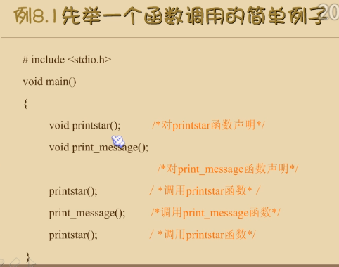
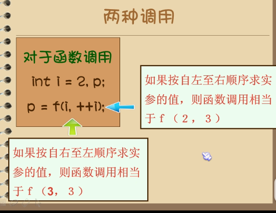
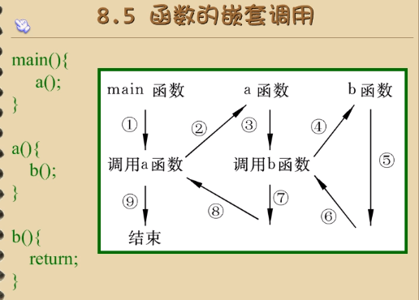
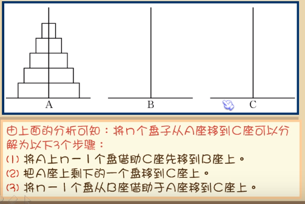
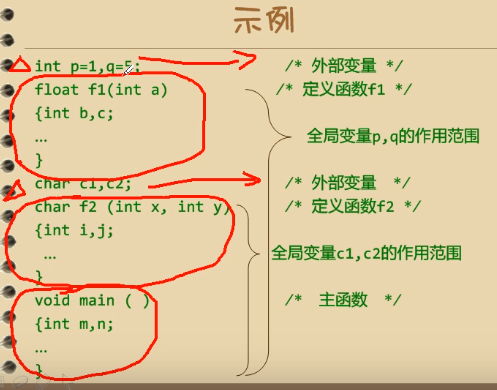
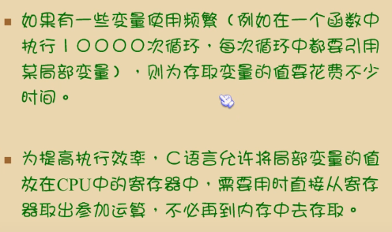
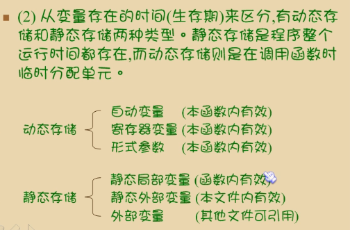

# 函数
- 定义
- 声明
- 调用


函数的定义
```
void printstar()
{
	printf("*********************\n");
}
void print_message()
{
	printf("how do u do!\n");
}
```




- 无参数函数定义

```
类型标识符 函数名([形式参数/实际参数])
{
	声明部分；
	语句部分；
}

int a=1;	//全局变量
int main(int x, int y)	//x，y是参数
{
	int z;
	z=x>y?x:y;
	return(z);	//返回值
}
```



将函数当参数，递归调用：
m=max(a,max(b,c));
printf("%d",max(a,b));


- 编写一个用于统计空格、制表符、与换行符的程序

```
void main()
{
	int space=0,tab=0,n=0;
	char x;
	int txt = 0, total = 0;
	printf("begin input:(press '#' to output the result)");
	while((x= getchar())!=EOF)	//按f6或c+z就出现EOF
	{	
		++total;
		if (x == ' ') ++space;
		else if (x == '\t') ++tab;
		else if (x == '\n') ++n;
		else ++txt;

	}
	printf("总字数=%d,正文=%d,space=%d,tab=%d,enter=%d", total, txt, space, tab, n);
	system("pause");
}
```

- 自己编一个求开方的程序

```
int sq(int x)
{
	int y=0,i;
	for (i = 1; i <= x; i++)
	{
		if (x == i * i ) {
			y = i;
			break;
		}
	}
	return y;
}

void main()
{
	int n,x=49,y;
	y = sq(x);
	if (y) printf("%d^0.5=%d",x, y);
	else printf("no sqrt");
	system("pause");
}
```

# 函数的嵌套定义与嵌套调用



- 计算s=2^2!+3^2!

```
int factorial(int x)
{
	int y=1;
	for (; x >0; x--)
	{
		y = y * x;
	}
	return y;
}
void main()
{
	int s;
	s = factorial(pow(2,2))+ factorial(pow(3,2));
	printf("s=%d", s);
	system("pause");
}
```
# 递归调用

递归必须有个推出的条件，递归比递推法效率低

```
int f(int x)
{
	int y,z;
	z=f(y);
	return (2*z);
}
```

- 用递归求n！

remark:每次递归调用的实参为x-1，赋值给x，最后当n-1==1时结束递归迪调用，逐层退回。

```
int factorial(int x)
{
	long y;
	if (x < 0) printf("error\n");
	else if (x == 0 || x == 1) y = 1;
	else  y = x * factorial(x-1);
	return y;
}
void main()
{
	int s,x=3;
	s = factorial(x);
	printf("s=%d", s);
	system("pause");
}
```
- 汉诺塔问题：移动盘子

步骤：


```
void hanoi(int n, char A, char B, char C)
/*定义hanoi函数，将N个盘子从A座借助B座移动到C座*/
{
	void move(char x, char y);
	if (n == 1) move(A, C);
	else
	{
		hanoi(n - 1, A, C, B);
		move(A, C);
		hanoi(n - 1, B, A, C);
	}

}
void move(char x, char y)
{
	printf("%c-->%c\n", x, y);
}
void main()
{
	int n;
	for (;;)
	{
		printf("input a number:");
		scanf("%d", &n);
		printf("the step to moving %d disks:\n", n);
		hanoi(n, 'A', 'B', 'C');
		if (getch() ==27 ) break;
	}
	system("pause");
}
```

# 数组作为元素做函数参数

- 判别一个数组a[10] = {1,2,3,4,-1,-2,-3,-4,2,3}中各元素的大小，若大于0则输出该值，否则输出0.
```
int f(int x)
{
	if (x > 0) printf("%d,", x);
	else printf("0,");
}
void main()
{
	int i,a[10] = {1,2,3,4,-1,-2,-3,-4,2,3};
	for (i=0;i<10;i++)
	{
		f(a[i]);
	}
	system("pause");
}
```

# 数组名作为函数参数

数组名做函数参数时，传送的是地址，把实参数组的首地址赋予形参数组名。
在定义函数类型时需要定义同样形式的形参。

```
void f(int b[])	//可以省略数组的长度，因为这个数组是指向a的地址的。
{
	int i = 0;
	for (; i < 5; i++)
	{
		printf("%d,", b[i]);
	}
}

void main()
{
	int a[10] = {1,2,3,4,-1,-2,-3,-4,2,3};
	f(a);
	putchar('\n');
	system("pause");
}
```

# 局部变量

主函数中定义的变量（m，n）只在主函数中有效，在整个文件中不一定有效。

```
void main()
{
	int a,b;

	{
		int c;
		c=a+b;	//c只在这个大括号内有效，a,b在main内都有效。
	}
}
```

# 全局变量

全局变量是在函数外定义的变量，也称外部变量



想要在同一个函数return多个值需要定义额外的全局变量。

```
int s1;
int vs(int a,int b)
{
	int v;
	v=a*b;
	s1=a*b;
	return v;
}
void main()
{
	int v;
	int a=1,b=1;
	v=vs(a,b)
	printf("%d,%d",v,s1);
	getch();
}
```
# 静态存储与动态存储

动态存储：在程序运行期间根据需要进行动态的分配存储空间的方式

- auto
```
auto int a;
等价于
int a;
```
- static
相当于全局变量，但出了这个函数就不能调用。函数调用结束时这个变量并不消失
```
static int c=3;	//c==3
c=c+1;	//c==4
static int c=3;	//c==4	再次赋初值并不能改变它的值
c=c+1;	//c==5
```
- 输出1到5的阶乘

```
int fac(int n)
{
	static int f = 1;
	f = f * n;	//1,2,2*3,6*4,24*5
	return (f);	//1,2,6,24,120
}
void main()
{
	int i;
	for (i = 1; i <= 5; i++)
	{
		printf("%d!=%d\n",i,fac(i));	//fac=1,2,6,24,120
	}
	getch();
}
```

# register寄存器变量

直接放在cpu寄存器中，能快速调用


- 输出1到n的阶乘

```
int fac(int n)
{
	register int f = 1;
	f = f * n;	//1,2,2*3,6*4,24*5
	return (f);	//1,2,6,24,120
}
void main()
{
	int i;
	for (i = 1; i <= 5; i++)
	{
		printf("%d!=%d\n",i,fac(i));	//fac=1,2,6,24,120
	}
	getch();
}
```
# extern声明外部变量，作用范围相当于全局变量

```
void main()
{
	extern a,b;	//定义放在main后面时，要在此处声明外部变量来调用
	printf("%d,%d",a,b);
}
int a=13,b=-8;
```

# 在多文件的程序中声明外部变量

```
//1.c
int A = 1;	/*定义性申明：定义外部变量*/
void main()
{
	int f(int x);
	int x;
	x = 1;
	printf("%d", f(x));
	getch();
}

//2.c
extern A;	/*引用性声明：声明A为已定义的外部变量*/
int f(int x)
{	
	int y;
	y=A*x;
	return y;
}
/*直接编译main文件即可*/
```

- 用static声明外部变量，使得全局变量只能在本文件使用。
```
static int A;
```





- 内部函数：只能被本文件调用的函数

用static定义函数类别，不加static则默认是外部函数
```
static int f(int a)
{
	...;
	return;
}

/********************/
int f(int a)
等价于
extern int f(int a)
```


