# 直接访问与间接访问

直接访问：
a=5;

在编译时，对变量分配了地址。

间接访问：
scanf("%d",&a);

# 指针
*：取值操作符
&：取址操作符

```
int i;
int *x;	//声明定义
x=&i;	//取址
printf("%d\n",*x);	//取值
```

指针是一种特殊变量，存放的是地址。
- int *x;用来定义指针变量，可以通过语句x=&a;使得变量x中存放a的地址。
- 可以通过变量的地址来访问这个变量，变量的地址称为该变量的“指针”。因此可以专门用一个变量来存放变量的地址（==指针），称为【指针变量】
- 指定的基类型int、float与索取的地址所在的变量格式一致
- *和&的优先级别相同，从右向左计算。因此&*x==&a，即a的地址
- *&a==*x==a
- (*x)++==a++，++与*优先级别相同，从右到左计算，需要括号

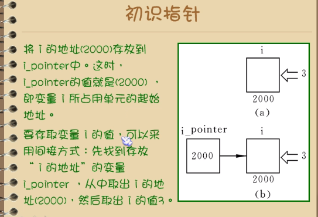

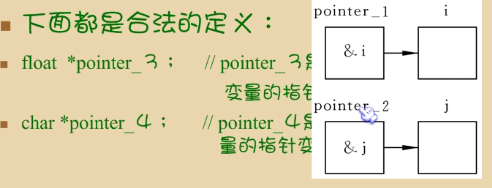

- 输入三个数abc，由小到大输出
```
void swap(float *a, float *b);
void main()
{
	float a, b, c;
	printf("input numbers a,b,c:\n");
	scanf_s("%f,%f,%f", &a, &b, &c);

	if (a > b) swap(&a, &b);	//向swap函数赋实参a的地址，让swap把ab的值交换。
	if (a > c) swap(&a, &c);
	if (b > c) swap(&b, &c);

	printf("a=%f,b=%f,c=%f\n", a, b, c);
	system("pause");
}
void swap(float *a, float *b)
{
	float t;
	t = *a;
	*a = *b;
	*b = t;
}

//解法2
void swap(float *x, float *y)	//当参数为指针或数组时，传递的是地址。
{
	//将地址x处的值与地址y处的值交换
	float t;
	t = *x;	
	*x = *y;	//x与y代表地址，星号是取值，将n1、n2这两个住所里放的值相互交换。函数调用完成并退出后，n1、n2的值发生改变。
	*y = t;
}
void exchange(int *x, int*y, int*z)
{
	void swap(int *a, int*b);
	if (*x < *y) swap(x, y);
	if (*x < *z) swap(x, z);
	if (*y < *z) swap(y, z);
}
void main()
{	
	void exchange(int *x, int*y, int*z);
	int n1, n2, n3, *x, *y, *z;
	printf("input three numbers to compare:");
	scanf("%d,%d,%d", &n1, &n2, &n3);
	x = &n1;
	y = &n2; 
	z = &n3;
	exchange(x, y, z);	//调用指针变量时输入变量名，不带星号。
	printf("%d>%d>%d", n1, n2, n3);
	getch();
}
```
# 数组与指针
可以用一个指针变量定义一个数组元素。
```
int a[10];
int *p;
p=&a[0];

/****************/
下标法：
p=a;等价于p=&a[0];

指针法：
*(a+i)等价于*(p+i)
```
- 输出数组中的全部元素
```
void main()
{	
	int a[10] = { 9,8,7,6,5,4,3,2,1,0 };
	int *p,i;

	for (p=a; p <(a+ 10); p++)
	{	
		printf("%d ",*p);
	}
	getch();
}
//解法2
void main()
{	
	int a[10] = { 9,8,7,6,5,4,3,2,1,0 };
	int *p,i;
	p = a;	//a==数组a首个元素的地址
	for (i = 0; i < 10; i++)
	{	
		printf("%d ",*(p+i));	//等价于printf("%d ", *(a + i));
	}
	
	getch();
}
```
- 用数组名做函数参数
编译器会将arr[]按指针变量处理，等价于处理函数f(int *arr,int n)
```
void f(int arr[],int n)
{
	...;
}
void main()
{
	int array[10];
	...;
	f(array,10);
}
```
- 将数组a[10] = { 9,8,7,6,5,4,3,2,1,0 };的数字倒过来摆放。
```
void f(int a[], int n)
{	
	int i,t;
	for (i = 0; i <=n/2; i++)
	{
		t = *(a+i);
		*(a+i) = *(a+n-i-1);	//将main内的数组a进行了改变。如果不是指针而是普通int，则传递的是值，只在f()内生效，不会改变main里的a的值。
		*(a + n - i-1) = t;
	}
}
void main()
{
	int k;
	int a[11] = { 9,8,7,6,5,4,3,2,1,0,10 };
	f(a, 11);
	for (k = 0; k < 11; k++)
	{
		printf("%d ", a[k]);
	}
	getch();
}

//解法2
void f(int a[], int n)
{
	int i, t;
	for (i = 0; i <= n / 2; i++)
	{
		t = a[i];
		a[i] = a[n - i - 1];	//a[i]数组元素类似指针，也传递的是地址。
		a[n - i - 1] = t;
	}
}
```
- 从10个数种找出最大值和最小值
```
void f(int a[], int n)
{
	int max, min, i, *p;
	max = a[0]; min = a[0];
	for (p = a; p < a + n; p++)
	{
		if (max < *p) max = *p;
		if (min > *p) min = *p;
	}
	printf("max=%d,min=%d", max, min);
}
void main()
{
	int k;
	int a[10] = { 9,8,7,6,5,4,3,2,1,0 };
	f(a, 10);
	
	getch();
}
```
# 多维数组与指针
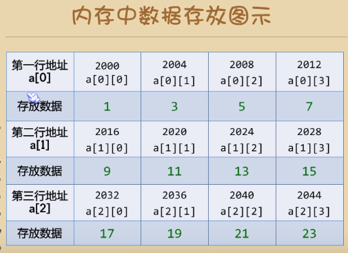
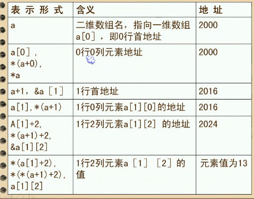

把二维数组a[3][4]分解为一维数组a[0],a[1],a[2]之后，设p为指向二维数组的指针变量：
int (*p)[4];	//括号不能掉

y=*(p+i)+j是二维数组i行j列的元素地址，而*y是i行j列元素的值。
- 打印3x4的矩阵。
```
void main()
{
	int a[3][4] = { 1,2,3,4,5,6,7,8,9,10,11,12};
	int(*p)[4];
	int i, j;
	p = a;
	for (i = 0; i < 3; i++)
	{
		for (j = 0; j < 4; j++)
		{
			printf("%d\t", *(*(p + i)+j));
		}
		printf("\n");
	}
	
	getch();
}
```

# 字符串指针

可以看到string被定义为一个指针变量，指向字符型数据，请注意它只能指向一个字符变量或其他字符类型数据,不能同时指向多个字符数据,更不是把“I love China!"这些字符存放到string中(指针变量只能存放地址)，也不是把字符串赋给* string。只是把“I love China!"的第1个字符的地址赋给指针变量string。
```
void main()
{
	char *string1="i love you!";	
	//将字符串在内存中的存放地址放进一个栈，令字符串的第一个字符的地址填到指针变量string1里
	//char string2[]="i love you!"	//将字符串的元素一个一个放进数组，每四个字符放进一个数组元素，用寄存器存放。字符串太长会进入内存存储
	printf("%s\n", string);
	getch();
}
```

# 字符串中字符的存取方法
- 数组法
 ```
 void main()
{
	char a[] = "i love you,i love him.", b[40];	//字符串数组
	int i;
	for (i = 0; *(a + i) != '\0'; i++)
	{
		*(b + i) = *(a + i);
	}
	*(b + i) = '\0';	//'\0'是字符串结束的标志
	printf("string a is:%s\n", a);
	printf("string b is:");
	for (i = 0; b[i] != '\0'; i++)
	{
		printf("%c", b[i]);
	}
	getch();
}
```
- 指针法
```
void main()
{
	char a[] = "i love you,i love him.", b[40],*p1,*p2;
	int i;
	p1 = a;
	p2 = b;
	for (;*p1!='\0';p1++,p2++)
	{
		*p2 = *p1;
	}
	*p2 = '\0';
	printf("string a is:%s\n", a);
	printf("string b is:");
	for (i = 0; b[i] != '\0'; i++)
	{
		printf("%c", b[i]);
	}
	getch();
}
```
- 用函数调用实现字符串的复制
```
void copy_1(char a[],char b[]) {
	int i = 0;
	while(a[i]!='\0')
	{
		b[i] = a[i];
		i++;
	}
	b[i] = '\0';
}
void main()
{
	char a[11] = "i love you";
	char b[11] = " ";
	
	copy_1(a, b);
	printf("a=%s\nb=%s\n", a, b);
	getch();
}

//解法2
void copy_1(char *a, char *b) {
	for (; *a != '\0'; a++, b++)
	{
		*b = *a;
	}
	*b = '\0';
}
void main()
{
	char *a = "i love you";	//进入常量存储区，不能被写入别的值。
	char b[]="          ";	
	//b是被写入的变量，不能为*b。因为反汇编可以看出，
	copy_1(a, b);
	printf("a=%s\nb=%s\n", a, b);
	getch();
}

//copy_1函数的变体
void copy_1(char *a, char *b) {
	while ((*b = *a)!='\0')
	{
		b++;
		a++;
	}
}

//copy_1函数的变体
void copy_1(char *a, char *b) {
	while ((*b++ = *a++)!='\0')	//指针比++的运算优先级高
	{
		;	
	//a里面元素取完了遇到'\0'【ASCII码是0，使得条件判断*b=0为假】就自动停止循环
	}
}

//copy_1函数的变体
void copy_1(char *a, char *b) {
	while (*a!='\0')
	{
		*b++ = *a++;
	}
	*b='\0';
}
```
# 字符指针变量和字符数组的关系

1. 字符数组是将字符串的字符依次放到数组元素中；字符指针变量是将字符串的字符的地址依次放到指针变量中。
2. 赋值规则：
```
//错误示范。因为不能将字符串放到第一个数组元素中。
char str[20];
str="i love u";
```
但字符指针变量可以
```
char *a;
a="i love u";	//赋给a的不是字符，而是字符串第一个字符的地址。并将第二个字符地址自动赋给指针变量(a+1)...

//如下例子能很好的展现这一现象：
void main()
{
	char *a = "i love you";	
	printf("a=%s\n", a);
	a += 2;
	printf("a=%s\n", a);
	getch();
}
```
result:
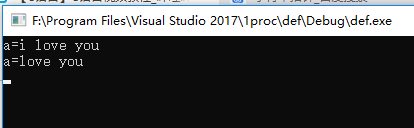


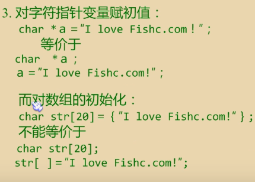
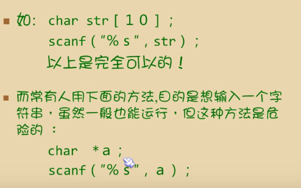

3. 定义了字符指针变量后，可以像数组那样用下标索引字符指针中的字符。
```
void main()
{
	char *a = "i love you";
	int i;
	printf("the 6th character is %c\n", a[5]);	
	//第一个字符是a[0]
	for (i = 0; a[i] != '\0'; i++)
	{
		printf("%c,",a[i]);
	}
	getch();
}
```
# 指向函数的指针
函数被编译时会被分配一个入口地址，这个函数的入口地址就被称为函数的指针。

```
void main()
{
	int maxm(int a, int b);	//申明函数
	int a = 5, b = 6, c;
	int(*p)();
	p = maxm;	//将函数的地址赋值给指针p
	c = (*p)(a, b);	//用*p调用函数名
	printf("max of %d and %d is %d\n", a, b, c);
	getch();
}

int maxm(int a, int b)
{
	int t;
	t = (a > b) ? a : b;
	return t;
}
```

# 指向函数的指针作为函数的参数
在被调用的函数中使用实参函数

```
//***例一***
f(int (*p)(int x))

//***例二***
//函数F有两个形参g、u，它们是指向函数的指针变量。
//在调用函数F时，实参是两个函数名g、u，给形参传递是两个函数的地址。
void F( int(*g)(int) , int(*u)(int,int) )
{
	int a,b,i,j;
	a=(*g)(i);	//调用函数g
	b=(*u)(i,j);	//调用函数u
	...;
}

```

- 设计一个函数process，在调用它的时候，每次实现不同功能。
输入ab两个数，第一次调用process时找出最大者，第二次找出其中最小者，第三次求ab的和。

```
void main()
{
	void process(int, int,int(*f)());	//申明函数
	int max1(int, int);
	int min1(int, int);
	int sum1(int, int);

	int a = 5, b = 6;
	printf("max = ");
	process(a, b, max1);
	printf("min = ");
	process(a, b, min1);
	printf("sum = ");
	process(a, b, sum1);
	getch();
}
void process(int a, int b, int(*f)())
{

	if (f == max1) max1(a, b);
	if (f == min1) min1(a, b);
	if (f == sum1) sum1(a, b);

}
int max1(int a, int b)
{
	printf("%d,", (a > b) ? a : b);
}
int min1(int a, int b)
{
	printf("%d,", (a < b) ? a : b);
}
int sum1(int a, int b)
{
	printf("%d", a+b);
}
```
# 返回指针值的函数

返回指针型的数据，即地址。

函数的定义：int *f(int x,int y);

- 若干学生的4门课的成绩，要求输入学生序号后，能输出该学生的全部成绩。用指针函数实现
```
void main()
{
	int *score(int id, int (*a)[4]);	//申明函数(*a)[]传递的是数组的地址。
	int id,i,*y;
	int a[3][4] = {90,90,90,90,91,91,91,91,92,92,92,92};
	printf("input the student id:"); //0 1 2
	scanf("%d", &id);
	y=score(id,a);	//调用函数时只需填入变量名。
	for (i = 0; i < 4; i++)
	{
		printf("%d ", *(y + i));
	}
	getch();
}
int *score(int id,int (*a)[4])	//二维数组的指针定义方式
{
	int *y;
	y = *(a+id);	//对于二维数组，*(a+i)+j表示第i行j列元素的地址。取两次星号才能取到值。
	return y;
}
```
- 对于上例学生，找出其中有不及格课程的学生号
用指针函数取出数组元素地址，再看是否及格。
```
void main()
{
	int *f(int (*a)[4]);	//申明函数(*a)[]传递的是数组的地址。
	int a[3][4] = 
	{
		90,90,90,90,
		91,91,59,91,
		59,60,60,60
	};
	int i,j,*y;
	
	for (i = 0; i < 3; i++)
	{
		for (j = 0; j < 4; j++)
		{
			y = f(i, j, a);	//用指针函数取出数组元素地址
			if (*y < 60) printf("student %d failed course %d.\n",i,j);
		}
	}

	getch();
}
int *f(int i,int j,int (*a)[4])	//二维数组的指针定义方式
{
	int *y;
	y = *(a + i) + j;
	return y;
}
```
# 指针函数与函数指针

指针函数是指 **带指针的函数**
```
int f(int *p,int (*p)[4])
{
	...;
}
```
函数指针是 **指向函数的指针变量**
```
int (*p)();	//定义一个函数指针
p=f;	//将函数的地址赋值给指针p
```
# 指针数组、指向指针的指针
指针数组：它是一个数组。数组中的元素都是指针类型数据，其中每个元素都相当于一个指针变量。
一维指针数组定义为：
```
int *name[4];
```
前面用int (*p)[4];定义一个指向二维数组的指针，*(p+i)+j是某行某列的地址，p的本质是一个指针变量。

- 例子:打印出各个指针数组元素代表的地址里放的住客是谁。
```
void main()
{
	int a[5] = { 0,1,2,3,4 };
	int *name[5] = { &a[0],&a[1], &a[2], &a[3], &a[4] };
	int i;
	for (i = 0; i < 5; i++)
	{
		printf("%d\n", *name[i]);	//星号取数组中第i个指针元素的值，即a[i]。
	}
	getch();
}
```
remark:输出格式
```
void main()
{
	char *name[] = { "Fishc.com","www.fishc.com","home.fishc.com","fuck you!","Thank you!" };
	printf("%s\n", name[0]);	//*name[]的星号表示这个数组里面的元素都是含有地址的指针变量。当里面的元素是字符串时，字符串的存储方式是一个字符存在一个地址，但引用时，name[i]就表示字符串。
	int a[5] = { 0,1,2,3,4 };
	int *m[5] = { &a[0],&a[1], &a[2], &a[3], &a[4] };
	printf("%d\n", *m[0]);	//输出的是*(&a[0])==a[0]
	printf("%p\n", m[0]);	//输出的是&a[0]
	getch();
}
```


- 将下边的字符串按首字母顺序由小到大输出。
```

#include <string.h>
#if(1)
void main()
{	
	void paixu(char *p[],int n);	//形参:指针数组*p[]
	void print(char *p[],int n);
	char *name[] = { "Fishc.com","www.fishc.com","home.fishc.com","fuck you!","Thank you!" };  //name[0]到name[4]都是指针，里面放的字符串的首字符地址。
	int n = 5;
	paixu(name,n);
	print(name, n);
	
	system("pause");
}

void paixu(char *p[],int n)	//用擂台法排序
{
	int i,j;
	char *t;	//指向数组元素的指针要与数组类型一致
	for (i = 0; i < n-1; i++)
	{	
		for (j = i + 1; j < n; j++)
		{
			if (strcmp(p[i], p[j]) > 0)
			{
				t = p[i];	//调换了地址。
				p[i] = p[j];
				p[j] = t;
			}	
			
		}

	}
}

void print(char *p[],int n)
{
	int i;
	for (i = 0; i < n; i++)
	{
		printf("%s\n", p[i]);	//

	}
}
#endif
```
- 将字符串的字符按字母顺序由小到大输出

```
//tbc 
void main()
{	
	char *name[] = { "Thank you!" };
	int n = 5;
	char t;
	printf("%s\n", name[0]);
	int i, j, k,y;
	char **a[100];	
	for (i = 0; *(name[0] + i) != '\0'; i++)
	{
		a[i] = name[0]+i;
		printf("%c,",*a[i]);
	}
	a[i] = '\0';
	k = i;
	for (i = 0; i < k - 1; i++)
	{
		for (j = 1; j < k; j++)
		{
			if (strcmp(*a[i], *a[j]) > 0)
			{
				t = *a[i];
				*a[i] = *a[j];	//bug：放在常量区，不能被写。
				*a[j] = t;
			}
		}
	}
	printf("name[0]=%s", name[0]);
	system("pause");
}
```
# 指向指针的指针

char **p;
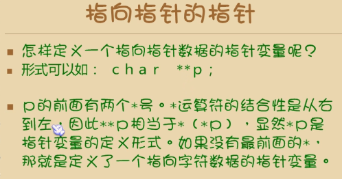

- **p指向一个字符指针变量
```
void main()
{	
	char *name[] = { "Fishc.com","www.fishc.com","home.fishc.com","fuck you!","Thank you!" };
	char **p;
	int i;
	for (i = 0; i < 5; i++)
	{
		p = name + i;
		printf("%s\n", *p);
	}
	
	system("pause");
}
```
# 指针数组做main函数的形参
例如void main(int argc,char *argv[])

```
//编译后以cmd运行，输入若干空格隔开的字符串，回车。
void main(int argc, char *argv[])
{	
	int i;
	printf("the num of str is:%d\n", argc - 1);
	for (i = 1; i < argc; i++)
	{
		printf("the str %d is:%s\n", i, argv[i]);
	}
	system("pause");
}
```
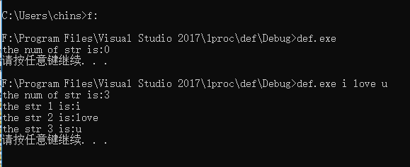

# 小结

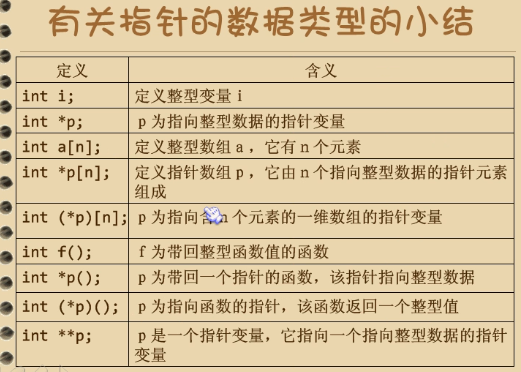
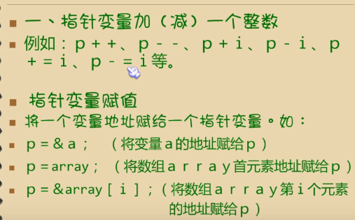
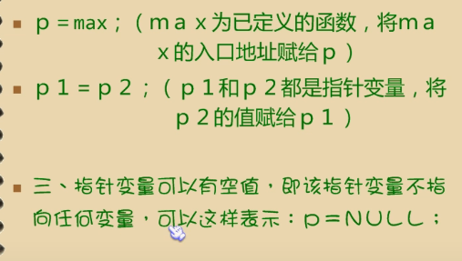	//此时指针变量p1和p2都指向同一个东西
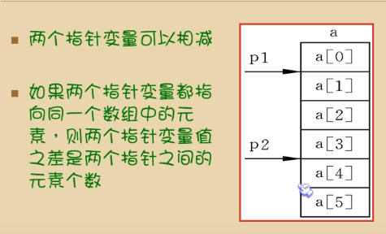	

## void指针

void *p;

不指定它是指向那一种类型数据的指针变量，仅仅用来存放一个地址

可以用任何类型的指针直接给void指针赋值。但是如果需要将void指针的值赋给其他类型的指针，则需要进行强制类型转换。

## const指针


```
/***例1***/
void main()
{	
	const char *str = "welcome!";
	//申明一个指针变量str
	//定义指针变量str指向一个字符串常量，字符串常量不能改变
	printf("%s\n\n",str);	//welcome
#if(0)
	str[0] = 'w';	//改变被指针所指的数据，非法！
#endif
	str = "i love u\n";	//改变str的值，合法！
	printf("%s", str);	//i love u
	system("pause");
}

/***例2***/
void main()
{	
	char * const str = "welcome!";
	//定义一个常量指针str，不可以改变str的值，但它所指的数据可以改变
	printf("%s\n\n",str);	//welcome
	str[0] = 'w';	//改变被指针所指的数据，合法！
#if(0)
	str = "i love u\n";	//改变str的值，非法！
#endif
	printf("%s", str);	
	system("pause");
}

/***例3***/
void main()
{	
	const char * const str = "welcome!";

	printf("%s\n\n",str);	//welcome
#if(0)	
	str[0] = 'w';	//改变被指针所指的数据，非法！
	str = "i love u\n";	//改变str的值，非法！
#endif
	printf("%s", str);	
	system("pause");
}
```
## memcpy
memory copy

memcpy函数：
void *memcpy(void *dest,const void *src,size_t count);

