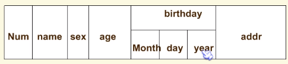
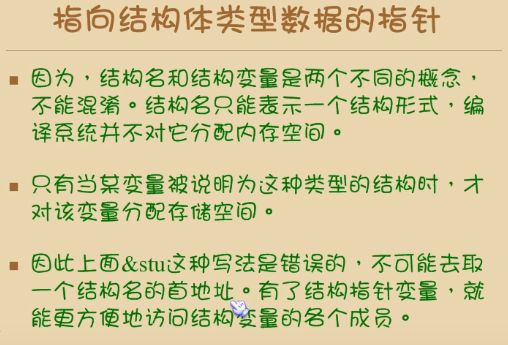
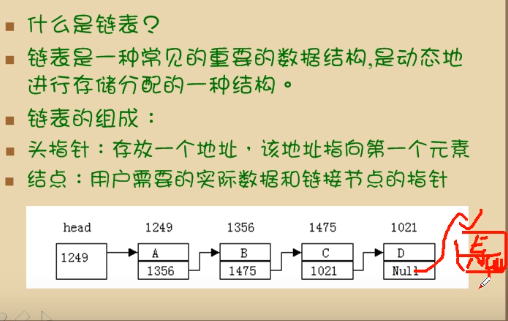
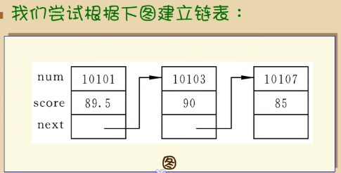
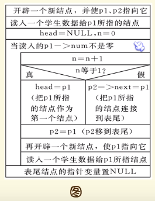
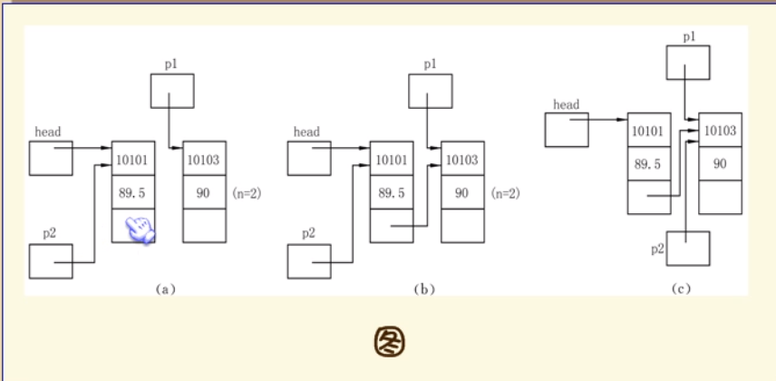
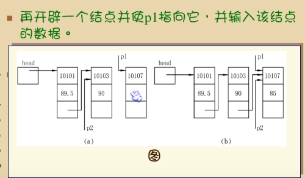
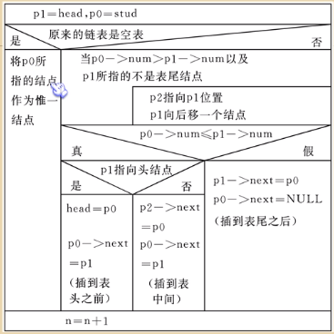

# 概述

有时需要将不同类型的数据组合/封装成一个有机的整体，以便于引用。


# 定义结构体类型变量的方法


定义一个结构的一般形式为：
```
struct 结构名
{
	[成员列表
	类型说明符 成员名;]
};

/*第1种定义方式：先声明，再定义变量*/
struct student
	{
		int num;	//4byte
		char name[20];	//20
	};
struct student student1, student2;
```
第2种定义方式：声明类型的同时定义变量
```

struct student
	{
		int num;	//4byte
		char name[20];	//20
		char sex;	//1==》4
		int age;	//4
		float score;	//4
		char addr[30];	//30==》32
	}student1, student2;	
//定义student1和student2位struct student类型的变量，它们具有struct student类型的结构，各占4+20+4+4+4+32=68byte【4+20+1+4+4+30=63byte】
printf("%d\n", sizeof(student1));
```
第3种定义方式：省略结构体名
```

struct
	{
		int num;	//4byte
	}student1, student2;
```
- 结构体的嵌套：

```
void main()
{
	struct date
	{
		int month;
		int day;
		int year;
	};
	struct student
	{
		int num;
		char *name;
		char sex;
		struct date birthday;
		float score;
	}s1, s2;
	s1.num = 007;
	s1.name = "Jane";
	s1.birthday.year = 2010;
	s1.birthday.month = 12;
	s1.birthday.day = 23;
	printf("input sex and score\n");
	scanf("%c %f", &s1.sex, &s1.score);
	s2 = s1;	//s2的全体成员的值都赋给s1
	printf("number=%d,name=%s\n", s2.num, s2.name);
	printf("sex=%c,score=%f\n", s2.sex, s2.score);
	printf("birthday of student2 is %d-%d-%d\n", s2.birthday.year, s2.birthday.month, s2.birthday.day);
	getch();
}
```


**Remark**
- 输出：不能将结构体变量作为一个整体进行输入和输出
```
/*错误示范*/
printf("%d,%s,%c,%d,%f\n",s1);
/*正确示范：结构体变量明.成员名*/
printf("%d\n",s1.name);
```
- “.”是成员（分量）运算符，在所有运算符中优先级最高。
s1.num=100;	//将100赋给s1变量的成员num。
- 对于嵌套的结构体，只能对最低一级的成员进行赋值、存取、运算
在访问成员时要控制到最低成员：
s1.num
s1.birthday.year
- 结构体变量的地址主要用作函数参数，传递结构体变量的地址。


# 结构体变量的引用
可以引用结构体变量成员的地址，也可以引用结构体变量的地址。

```
void main()
{
	struct student
	{
		int num;
		char *name;
		char sex;
		float score;
	}s1, s2;
	s1.num = 007;
	s1.name = "Jane";
	printf("address of struct student is %o\n", &s1);
	printf("address of s1.num is %o\n", &s1.num);	//前两个地址是一样的，因为num占了结构体的首地址。
	printf("address of s1.num is %o\n", &s1.name);	//这个地址就与前两者的地址不一致。
	getch();
}
```
# 结构体变量的初始化赋值
```
struct student
	{
		int num;
		char *name;
		char sex;
		float score;
	}s1={102,"Jane",'F',98.5}, s2;
s2=s1;
```
# 结构体数组
结构体数组中的元素是结构体，每个结构体包含一系列不同格式的成员数据。

- 定义方式与赋初值：
```
struct stud
{	
	int num;
	char name[20];
	char sex;
	int age;
	char addr[30];
}student1[2]={
				{101,"libai",'M',18,"beijing"},
				{102,"zhang",'F',19,"shanghai"}
};
```

- 例子：构建通讯录
```
#include <stdio.h>
#include<stdlib.h>

#define NUM 3
struct person	//定义结构体的成员结构
{
	char name[20];
	char phone[10];
};
void main()
{
	struct person man[NUM];	//定义结构体数组
	int i;
	for (i = 0; i < NUM; i++)	//结构体数组的初始化赋值
	{
		printf("input name:");
		gets(man[i].name);
		printf("input phone:");
		gets(man[i].phone);
	}
	printf("\tname\t\tphone\n\n");
	for (i = 0; i < NUM; i++)
	{
		printf("\t%s\t\t%s\n",man[i].name,man[i].phone);
	}
	system("pause");
}
```
- 对候选人得票的统计程序。有3个候选人，每次输入一个的票的候选人名字就为他记一票，要求最后输出各人的得票结果。共有5名投票者。
```
#include <stdio.h>
#include<stdlib.h>
#define VOTER 5
struct candidate
{
	char name[20];
	int vote;
};
void main()
{
	struct candidate temp[3],s[3] = {
		{"aa",0},{"bb",0},{"cc",0}
	};
	int i;
	char k[20];
	printf("Input names to vote for candidates.\nCandidates are:aa,bb,cc.\n");
	for (i = 0;i<VOTER; i++) {
		printf("第 %d 号投票:", i+1);
			loop:gets(k);
			if (!strcmp(k, "aa")) s[0].vote += 1; 			
			else if (!strcmp(k, "bb")) s[1].vote += 1;
			else if (!strcmp(k, "cc")) s[2].vote += 1;
			else 
				{ 
				printf("\t\tError,please reinput:"); 
				goto loop; 
				}
	}
	printf("\n\nResult:\nName\t\tVote\n\n");
	for (i = 0; i < 3; i++) {
		printf("%s\t\t%d\n", s[i].name, s[i].vote);
	}
	for (i = 0; i < 2; i++)
	{
		if (s[i].vote > s[i + 1].vote)
		{
			temp[0] = s[i];	//借用一个空的结构数组元素，将结构数组元素整体迁移
			s[i]= s[i + 1];
			s[i + 1] = temp[0];
		}
	}
	printf("\n本次投票活动胜利者是：%s\n", s[2].name);
	system("pause");
}
```
# 指向结构体类型数据的指针
即指向该结构体变量所占的内存段的起始地址。

定义：
struct 结构名 *结构指针变量名

赋值：赋给指针时不能用结构名
```
struct student
{...;
}boy1;
struct student *pstu;
pstu=&boy1

/*错误示范*/
pstu=&student
```


访问的一般形式：
```
(*结构指针变量).成员名
或
结构指针变量->成员名

(*pstu).num
//OR
pstu->num
```
- 例子：用三种形式输出成员
```
#include <stdio.h>
#include<stdlib.h>
struct stu
{	
	int num;
	char *name;
	char sex;
	float score;
}boy1 = {102,"Lisa",'F',78.5};
void main()
{
	struct stu *pstu;
	pstu = &boy1;

	printf("number=%d\nname=%s\nsex=%c\nscore=%f\n\n", boy1.num, boy1.name, boy1.sex, boy1.score);
	
	printf("number=%d\nname=%s\nsex=%c\nscore=%f\n\n", (*pstu).num, (*pstu).name, (*pstu).sex, (*pstu).score);

	printf("number=%d\nname=%s\nsex=%c\nscore=%f\n\n", pstu->num, pstu->name, pstu->sex, pstu->score);
	system("pause");
}
```
## 结构指针变量作函数参数
将结构体变量的值传递给另一个函数，有3种方法：
1. 用结构体变量的成员作参数
2. 用结构体变量作实参
3. 用指针指向结构体变量（或数组），指针作为实参，将结构体变量的地址传给函数的形参

- 例子：结构体stu包含学生号，姓名，三门课的成绩。通过调用函数print将它们输出。
```
#include <stdio.h>
#include<stdlib.h>	//system()
struct stu
{	
	int num;
	char *name;
	float score[3];
}boy1 = { 102,"Lisa",{78.5,80,90} };
void print(struct stu *p)
{	
	printf("number=%d\nname=%s\nscore=%f,%f,%f\n", p->num, p->name, p->score[0], p->score[1], p->score[2]);
}
void main()
{
	print(&boy1);	//直接赋实参，相当于定义一个指向boy1的指针、再把指针扔进函数。
	
	system("pause");
}

//解法2
#include<string.h>	
//strcpy(x,"abcd") 将字符串拷贝到字符串数组x[]里
struct stu
{	
	int num;
	char name[20];
	float score[3];
};
void print(struct stu boy)
{	
	printf("number\t=\t%d\nname\t=\t%s\nscore\t=\t%f,%f,%f\n", boy.num, boy.name, boy.score[0], boy.score[1], boy.score[2]);
}
void main()
{	
	struct stu boy1 = { 102,"" ,{78.5,80,90} };
	strcpy(boy1.name, "Lisa");	//不能对boy1.name直接赋值，因为它不是左值。
	//将name声明为指针才能赋值：char *name;...boy1.name="Xiao";此种做法是将数据常量区存储的字符串“Xiao”的地址赋给栈里的指针。

	print(boy1);
	system("pause");
}
```


# 用指针处理链表
## 动态存储分配
c语言不允许动态数组类型，数组的长度是预先定义好，在整个程序中固定不变

int a[2]={1,2};

char a[]="asf";

但c语言提供了一些内存管理函数，来动态地分配空间:
1. 分配内存空间的函数malloc、calloc
2. 释放内存空间的函数free

### malloc（）
函数原型：void *malloc(unsigned int size);

- 在内存的动态存储区中分配一个长度为size的连续空间，size是一个无符号数。
- 此函数的返回值是一个指向分配域起始地址的指针，指针类型为void。
- 如果此函数未能成功执行（例如内存空间不足），则返回空指针NULL
### calloc（）
函数原型：void *calloc(unsigned n, unsigned size);
- 在内存的动态存储区中分配n个长度为size的连续空间
- calloc可为一维数组开辟动态存储空间，n为数组元素个数，每个元素长度为size

### free（）
函数原型：void free(void *p);
- 将p指向的内存区释放，使这部分内存区能被其他变量使用
- p是最近一次调用calloc或malloc函数时返回的值。

## 链表
定义：


- 由头指针指向下一个元素(节点)，这个元素包含它的内容和下一个地址，最后一个元素只有内容和空地址。
- 可以动态地增加新元素

### 构建链表

```
struct student
{
	int num;
	float score;
	struct student *next;
};

void main()
{
	struct student c = { 10107,85, NULL }, *head;
	struct student b = { 10103,98,&c };
	struct student a = { 10101,89.5,&b };
	head = &a;
	do
	{
		printf("%ld %5.1f\n", head->num, head->score);
		head = head->next;
	} while (head);	//head==NULL（空）就结束循环。
	system("pause");
}
```
### 建立动态链表
在程序执行过程中从无到有建立起一个链表，即一个个地开辟节点和输入各节点数据，并建立起前后相链的关系
- 例子：建立一个含有三个学生的学号、成绩的单向动态链表。若输入学号0，则表示链表建立完成，该节点不会连接到链表中。




```
#include <stdio.h>
#include<stdlib.h>	//system()
#include<malloc.h>

#define LEN sizeof(struct student)
struct student *creat();			//创建链表
void print(struct student *head);	//打印链表。void print();省略参数不会报错

struct student
{
	int num;
	float score;
	struct student *next;
};

int n;	//全局变量，用来记录存放了多少数据。

void main()
{
	struct student *stu;
	stu = creat();
	print(stu);
	printf("\n\n");
	system("pause");
}

struct student *creat()
{
	struct student *head, *p1, *p2;

	p1 = p2 = (struct student *)malloc(LEN);	//动态的初始化，类似于(*p)[x]，[x]是待填充的内存大小。

	printf("input id and score.输入的id为0则链表建立结束。\n");
	printf("input id:");
	scanf("%d", &p1->num);
	printf("input score:");
	scanf("%f", &p1->score);
	head = NULL;
	n = 0;

	while (p1->num != 0)
	{
		n++;
		if (n == 1) head = p1;
		else p2->next = p1;
		p2 = p1;

		p1 = (struct student *)malloc(LEN);
		printf("input id:");
		scanf("%d", &p1->num);
		printf("input score:");
		scanf("%f", &p1->score);
	}
	p2->next = NULL;
	return head;	//只要找到链表首地址就可以知道整个链表
}

void print(struct student *head)
{	
	printf("\nthere are %d records!\n\n", n);
	while (NULL!=head)
	{
		printf("id=%d\tscore=%f\n", head->num, head->score);
		head = head->next;
	} 
}
```

- 链表与数组的区别：链表是有方向的。链表可以方便地更改中间节点的连接，数组不行。但数组可以迅速找到每个元素的编号和地址。

### 对链表的删除操作
- 练习：写一个函数，以删除动态链表中制定的节点
从第一个节点开始检查学号是否是要删除的那个。如果相等就将该节点删除，直到遇到表的结尾
先使p1、p2指向第一个节点，如果要删除的不是第一个节点，则p2=p1;p1=p1->next;保留该节点，再使p1挪向下一个节点

```
#include <stdio.h>
#include<stdlib.h>	//system()
#include<malloc.h>

#define NUM 10104
void print(struct student *head);
struct student *del(struct student *head, int id);

struct student
{
	int num;
	float score;
	struct student *next;
};

void main()
{
	struct student d = { 10104,85, NULL };
	struct student c = { 10103,98,&d };
	struct student b = { 10102,98,&c };
	struct student a = { 10101,89.5,&b };
	struct student *head = &a;
	printf("处理前的链表：\n");
	print(head);

	printf("\n处理后的链表:\n");

	print(del(head, NUM));
//如果想删除的不是head节点，则可以用不带返回值的cut函数，因为cut已经改变了后面的节点。但无返回值的cut函数无法改变第一个节点。
#if(0)
del(head,NUM);
	printf("\n处理后的链表:\n");
	print(head);
#endif

	system("pause");
}

struct student *del(struct student *head, int id)
{
	struct student *p1, *p2;
	if (head)
	{
		p1 = head;
		while (id != p1->num && p1->next != NULL)
		{
			p2 = p1;
			p1 = p1->next;
		}
		if (id == p1->num)
		{
			printf("\n删除了学号%d\n", id);
			if (p1 == head) head = p1->next;
			else p2->next = p1->next;
		}
		else printf("\n找不到该学号\n");
	}
	else printf("\n这是空表");
	return head;
}

void print(struct student *head)
{
	while (NULL != head)
	{
		printf("id=%d\tscore=%f\n", head->num, head->score);
		head = head->next;
	}
}
```
### 对链表的插入操作
如果链表中，学生学号是按从小到大顺序排列的，这样方便找到插入的位置。

```
#include <stdio.h>
#include<stdlib.h>	//system()
#include<malloc.h>

void print(struct student *head);
struct student *insert(struct student *head, struct student *p0);

struct student
{
	int num;
	float score;
	struct student *next;
};

void main()
{
	struct student d = { 10104,85, NULL };
	struct student c = { 10103,98,NULL};
	struct student b = { 10102,98,&d };
	struct student a = { 10101,89.5,&b };
	struct student *head = &a;
	printf("处理前的链表：\n");
	print(head);

	struct student *p0 = &c;

	printf("\n处理后的链表:\n");
	print(insert(head, p0));
	system("pause");
}

struct student *insert(struct student *head, struct student *p0)
{
	//int k=0;
	struct student *p1 = head,*p2;
	if (head) 
	{
		while (p1->next != NULL && p0->num > p1->num)
		//先找到插入的位置。
		{
			p2 = p1;
			p1 = p1->next;
		}
		if (p0->num <= p1->num)
		{
			if (p1== head)
			{
				head = p0;
			}
			else
			{
				p2->next = p0;	
			}
			p0->next = p1;
		}
		else
		{
			p1->next = p0;
			p0->next=NULL;
		}
	}
	else 
	{
		head = p0;
		p0->next=NULL;
	}
	return head;
}

void print(struct student *head)
{
	while (NULL != head)
	{
		printf("id=%d\tscore=%f\n", head->num, head->score);
		head = head->next;
	}
}
```
- 对上述程序实现动态录入和多次插入。
尝试制作一个学生成绩管理系统，输入错误自动排错。

**源代码过长，请查询文件[源代码_学生成绩管理系统.c](/源代码_学生成绩管理系统.c)**


# 共同体
## 用typedef定义类型
- 用typedef定义新的类型名来代替已有的类型名
- 可以声明类型名，但不能用来定义变量
- 没有创造新的类型
- 可以包装成.h头文件，有利于程序在不同系统的移植与通用
- #define p int* 只是简单替换，
p p1,p2;等价于int *p,p2;。
p2不是指针

- typedef (int*) q;	用q可以同时定义多个变量

声明integer为整型
typedef int INTEGER
```
typedef int INTEGER;
void main()
{
	INTEGER i = 1;
	int j = 2;
	printf("%d %d", i, j);
	system("pause");
}
```
- 声明结构类型
```
typedef struct
{
	int month;
	int day;
	int year;
}DATE;
void main()
{
	DATE x1;
	x1.day=12;
	x1.month=1;
	x1.year=2015;
	printf("%d - %d - %d\n",x1.year,x1.month,x1.day);
	system("pause");
}
```
- 用typedef声明NUM为整型数组类型
```
typedef int NUM[100];
void main()
{
	NUM num;
	printf("%d \n",sizeof(num));	//400
	system("pause");
}
```
- 用typedef声明STRING为字符指针类型
```
typedef char* STRING;
void main()
{
	STRING p1;
	p1 = "i love u";
	printf("%s \n",p1);	//
	system("pause");
}
```
- 声明POINTER为指向函数的指针类型，该函数返回整型值
```
typedef int (*POINTER)();
int f(int x)
{
	return 2*x;
}
void main()
{
	int y,x=1;
	POINTER a;
	a = f;
	y = a(x);
	printf("%d \n",y);	//
	system("pause");
}
```


