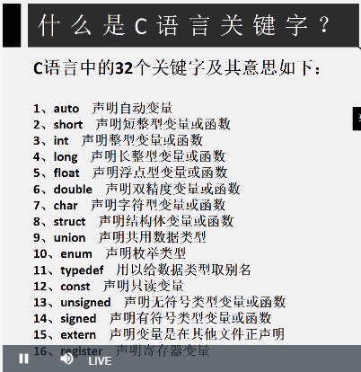
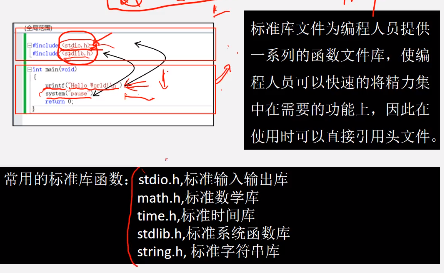

[toc]

# 编程前伪代码编写与代码规范意识建立


# head头文件


printf的使用要用到stdio头文件


头文件define.h的编写：

```
//现在.h里写下这一行
#define lesson_1 1
//然后在c文件里引用
#include <stdio.h> //input & output
#include <stdlib.h> //pause
#include <math.h>
#include "define.h"
#if lesson_1
	int main(void)
	{
		printf("\"hello world\"\n");	
		//输出{“hello world”}\n回车 \t缩进
		system("pause");
		return 0;
	}
#endif

```


- 例子

```
//printf输出
int main(void)	//返回int值的main函数，void或()都表示没有传入的参数
{
	int height;
	float weight;
	height = 175;
	weight = 75.6;
	printf("height=%d\nweight=%.2f\n",height,weight);
	system("pause");
	return 0;
}

//scanf_s("%d,%f",&height,&weight);
//scanf键盘键入：在dos窗口键入时的逗号和，%d与%f之间的逗号要一样


int main(void)	//返回int值的main函数，void或()都表示没有传入的参数
{
	long float area, r;
	long float PI = 3.14159;
	printf("type in radius\n");
	scanf_s("%lf", &r); 	//键入半径值
	area = PI * r*r;
	printf("area=%lf\n", area);
	system("pause");
	return 0;
}

```


# 函数


```

float cube(float x);	//函数声明
int main(void)
	{
		float x;
		float rx;
		x = 2.1;
		rx = cube(x);	//函数调用
		printf("result is %f\n", rx);
		system("pause");
		return 0;
	}

float cube(float x)
	{
		float y;
		y = x * x*x;
		return y;	//返回x^3的值到cube(x)函数
	}

```


- 交换x和y的值：

```
void swap(float *x, float *y);	//函数声明
float main(void)
{
	float x = 5.0;
	float y = 6.0;
	printf("x=%f,y=%f\n", x, y);
	swap(&x, &y);	//传入时要传指针,&是取址符,传递的是实参变量x,y的地址
	printf("result is %f,%f", x, y);
	system("pause");
	return 0;
}

void swap(float *x, float *y)
{
	float temp;
	temp = *x;
	*x = *y;
	*y = temp;
}
```


或者:输出x，y交换后的值，但实际x,y不交换值。
```

float swap(float x, float y);	//函数声明
int main()
{
	float x = 5;
	float y = 6;
	float z;
	printf("x=%f,y=%f\n", x, y);
	swap(x, y);
	printf("x=%f,y=%f\n", x,y);
	system("pause");
	return 0;
}

float swap(float x, float y)
{
	float temp;
	temp = x;
	x = y;
	y = temp;
	printf("%f,%f\n", x, y);	
	return 0;
}
```


- 多次求取圆的面积
```
void carea();
int main(void)	
{
	carea();
	carea();
	system("pause");
	return 0;
}
void carea()
{
	long float area, r;
	long float PI = 3.14159;
	printf("type in radius\n");
	scanf_s("%lf", &r); 	//键入半径值
	area = PI * r*r;
	printf("area=%lf\n", area);
}

```


# if else switch
```
switch ()
{
case 1:
	...; break;
case 2
	...; break;
	...
[default:...;]  //列举之外的所有其余情况会执行default内容
}
```

- eg:用户可以自行选择计算面积还是周长
```
//判断输入的符号是不是”a“
void main()
{
	char c;  //与*ctrl有所区别
	int treat;
	printf("\narea(a) or perimeter(p):\n ");
	//scanf("%s", c);
	c = getchar();
	treat = ('a' == c);
	printf("%d", treat);
	system("pause");
	return 0;
}


float area(float r);
float perimeter(float r);
void main()
{
	float r, result;
	char c;  //与*ctrl有所区别
	float treat;
	printf("\ninput radius and what u need\nradius=");
	scanf("%f", &r);
	getchar();	//加一个getchar不然就出bug
	printf("\narea(a) or perimeter(p):\n ");
	//scanf("%s", c);
	c = getchar();
	treat = ('a' == c);	//或者用strcmp(a,b)==0函数判断char是否相同
	printf("now calculate %c\n", c);
	result = treat * area(r) + (1 - treat)*perimeter(r);
	printf("\n result=%f\n", result);
	system("pause");
	return 0;
}
float area(float r) {
	float y;
	y = 3.14*r*r;
	return y;
}
float perimeter(float r) {
	float y;
	y = 2 * 3.14 * r;
	return y;
}

```


# 全局变量，局部变量
```
int n = 10;	//全局变量
void func1() {
	int n = 20;
	printf("%d\n", n);
}
int func2(int n) {
	printf("%d\n", n);
}
void func3() {
	printf("%d\n", n);
}

void main() {
	int n = 30;
	func1();	//20
	func2(n);	//30
	func3();	//10调用全局变量n

	{
		int n = 55;
		printf("55n=%d\n", n);	//55
	}
	printf("%d\n", n);	//30 调用main n
	system("pause");
}
```
# 寄存器变量

```
static int a, b;
auto char c1, c2;
static int a[3] = { 1,2,3 };
extern int x, y;

```

未加存储类型说明的变量均为自动存储类型变量 int i; <==> auto i;

register寄存器变量：只有局部自动变量和形式参数才可以定义为寄存器变量

extern外部变量：

static静态存储类型变量在整蛊程序运行期间都存在，b++之后重新调用会在之前的基础上计算

而之前那些变量int a = 1; 每次调用完后会消失，重新restore到最初的定义
```
void test() {
	auto a = 0.5;       //定义自动存储类型变量
	static int b = 3;   //定义静态存储类型变量
	a++;
	b++;
	printf("%d\n", a);
	printf("%d\n", b);
}

int main(){
	int i;
    /*调用三次test函数*/
	test();
	test();
	test();
	system("pause");

}
```

# 库函数

他人或自己写的函数代码库，集合成的头文件。包含了标准头的文件不能再使用标准库定义过的宏的名字作为其他元素的标识符，同时标准头中定义具有文件作用域的类型名不可以在文件中重定义。

标准库中经常在定义函数的同时，还定义了与函数同名的宏。默认情况下使用这样的函数，是使用宏调用，利用宏可以提高程序的运行速度。如果出于缩小可执行文件大小或获得函数指针的目的需要使用实际的函数，那么可以使用sundef来删除宏定义，同时也可以通过给函数名字加圆括号的方式来屏蔽宏调用。

```
#define max(x,y) printf("宏调用:"); \
  max(x,y)

/*屏蔽宏调用*/
(max)(x, y);

#  undef max
max(x, y);
```

《the standard C library（c标准库）》P.J.Plauger


头文件内容：

1. 基本的库函数

stdio.h和stdlib.h还有string.h这三个库函数，基本上是所有的c语言程序中都有的库函数，这三个分别是：

stdio.h:标准输入输出函数库；

strlib.h : 标准文件库函数；

string.h : 字符串处理函数库；

2. 一些常用的库函数：

signal.h和float.h和math.h，time.h，ctype.h这几个库函数是最常使用的

signal.h：使用信号量的时候，需要调用该库函数的函数；

float.h：浮点型处理函数库；

math.h：基本高级一点的数学处理函数库；

time.h：定时器需要使用的函数处理库；

ctype.h：这个是字符处理函数库；


标准头名	|功能	    |描述
---|---|---
<assert.h>	|诊断	    |仅包含assert宏。可以在程序中使用该宏来诊断程序状态（例如某个变量是否为0等），若检查失败，程序终止。
<ctype.h>   | 字符处理  | 包含判断字符类型及大小写转换的函数。
<errno.h>   | 错误监测  | 提供了errno。可以在调用特定库函数后检测errno的值以判断调用过程中是否有错误发生。
<float.h>   | 浮点数特性| 提供了描述浮点数特性的宏。
<limits.h>  | 整型特性  | 提供了描述整数类型和字符类型特性的宏。
<locale.h>  | 本地化    | 提供了一些支持程序国际化的函数。
<math.h>    | 数学计算  | 提供了大量用以数学计算的函数。
<setjmp.h>  | 非本地跳转| 提供了用于绕过正常的函数返回机制，从一个函数跳转到另一个正在活动的函数的setjmp和longjmp函数。
<signal.h>  | 信号处理  | 提供了包括中断和运行时错误在内的异常情况处理函数。
<stdarg.h>  | 不定参数  | 提供了支持函数处理不变个数的参数的工具。
<stddef.h>  | 常用定义  | 提供了常用的类型和宏。
<stdio.h>   | 输入输出  | 提供了大量输入输出函数。
<stdlib.h>  | 常用实用函数 | 提供了大量实用的函数。
<string.h>  | 字符串处理| 提供了大量字符串处理函数。
<time.h>    | 日期和时间| 提供了获取、操纵和处理日期的函数。


## stdlib.h


- 生成0~RAND_MAX之间的随机数

```
int main()
{
	int i, j;
	srand((int)time(NULL)); //使用最新的时间作为随机数的初始种子
	for (i = 0; i < 10; i++)
	{
		j = 1 + (int)(10.0*rand() / (RAND_MAX + 1.0));
		printf("%d\n", j);
	}

	system("pause");
	return 0;
}
```


## 构建库和库调用

```
///编写abc.h:
#ifndef __STATIC_H__
#define __STATIC_H_
#include <stdlib.h>
int func1(int a, int b);
#endif
///编写.c文件
#include "abc.h"
int func1(int a, int b)
{
	return a + b;
}

///生成的lib文件可以放在.c当前路径，在调用时附带路径。#include "d:/xxx/xxx/xxx.h"
///在"属性页/配置属性/vc++目录/包含目录"里添加lib路径
///"连接器/输入/附加依赖项"添加lib

```


# 循环语句
```
for (i=0参数初始化；i<100条件判断；i++更新循环变量) {	
	//执行100次大括号里的程序
	...;
}
```

```
while (1.0/i>1e-6) {	//i小于e的负六次方时停滞循环。只要控制表达式为true就会反复执行大括号内的代码
	i += 2;
}
```

```
do {

} while ()	//先执行一遍再判断，满足就执行下一次，不满足就跳出。
```


continue; continue和break有点类似，区别在于continue只是终止本次循环，接着还执行后面的循环，break则完全终止循环。
可以理解为continue是跳过当次循环中剩下的语句，执行下一次循环。


